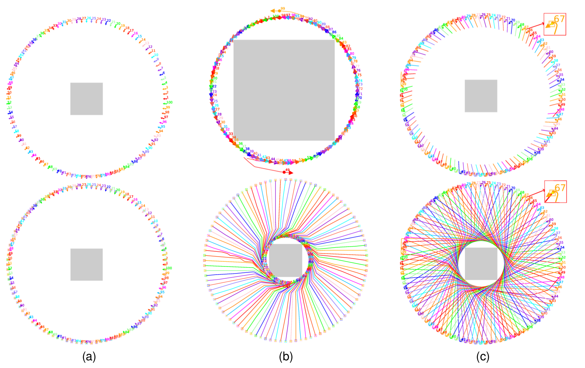
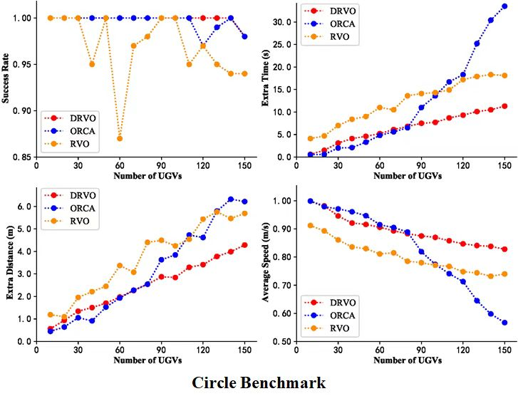
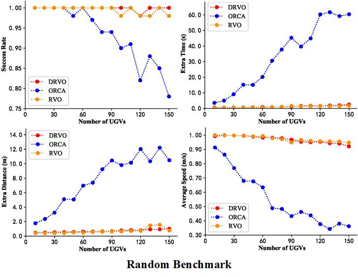
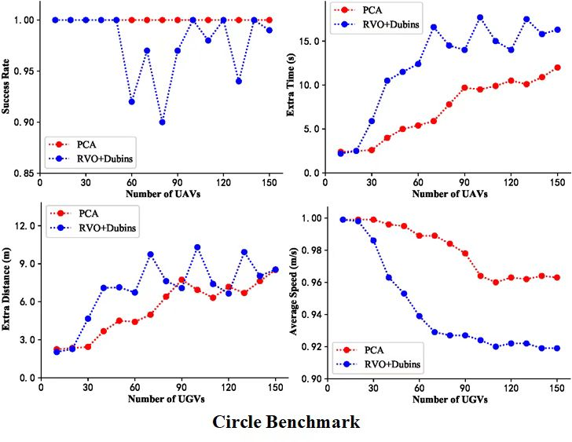
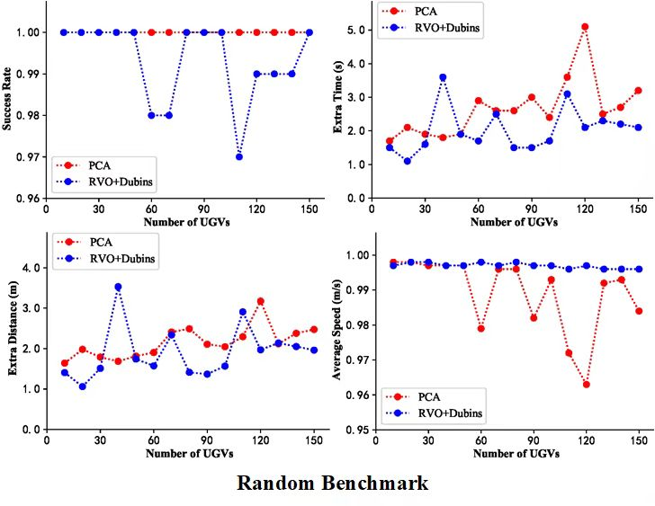
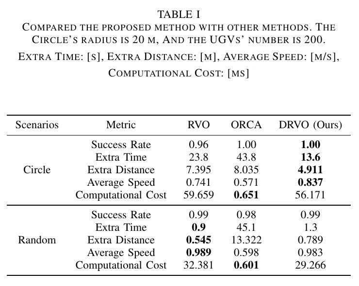
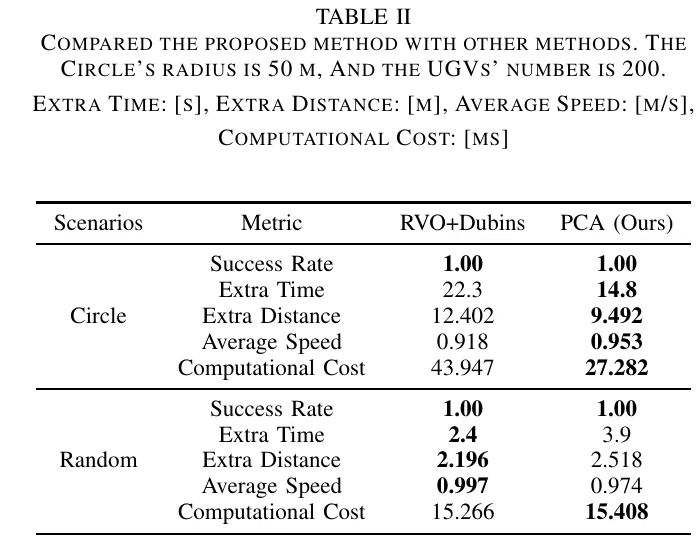

## Multi-Vehicle Motion Planning with Posture Constraints in Real World
Python Implementation of multi-vehicle motion planning, including our proposed method, namely postured collision avoidance (PCA), the reciprocal volocity obstacles (RVO), and the  optimal reciprocal collision avoidance (ORCA, also namely RVO2) .

-----

Description
-----

This paper investigates more practical applications in the real world for non-holonomic unmanned ground vehicles. In this case, a strategy of diversion is designed to optimize the smoothness of motion. Considering the problem of the posture constraints, a postured collision avoidance (PCA) algorithm is proposed for the motion planning of the multiple non-holonomic unmanned ground vehicles. In addition, we provide the optimal reciprocal collision avoidance (ORCA) method and reciprocal velocity obstacles (RVO) method for comparison.

About
-----

**Paper**:  Multi-Vehicle Motion Planning with Posture Constraints in Real World, Gang Xu, Yansong Chen, Junjie Cao\*, Deye Zhu, Weiwei Liu, and Yong Liu\*, Accepted as TMECH/AIM Focused Section Paper in IEEE-ASME Transactions on Mechatronics (**TMECH**).


-----

Requirement
-----

```python
pip install numpy
pip install pandas
pip install matplotlib
```

-----

Applications
-----

```python
cd run_py
python run_pca.py
For the test, you can select the scenarios, including circle, random.
```

#### Simulation 1:

<p align="center">
    
</p>


#### Experimental Results (Ours: DRVO, PCA):

<p align="center">
    
</p>
<p align="center">
    
</p>
<p align="center">
    
</p>
<p align="center">
    
</p>

#### Large Scale Results (Ours: DRVO, PCA):

<p align="center">
    
</p>
<p align="center">
    
</p>


----

References 
----

* Papers on [RVO](https://www.cs.unc.edu/~geom/RVO/icra2008.pdf), [ORCA](http://gamma-web.iacs.umd.edu/ORCA/publications/ORCA.pdf).


----

Discussion
----

In the first simulation, the preferred speed is 0.22 m/s. In the compared experiments, the preferred speed is 1.0 m/s. All agents' radius is 0.2 m. The radius of circle benchmark is set as 15 m for DRVO, ORCA and RVO. The square of random benchmark is set as 30 m * 30 m for DRVO, ORCA and RVO. The radius of circle benchmark is set as 40 m for PCA and RVO + Dubins. The square of random benchmark is set as 80 m * 80 m for PCA and RVO + Dubins. 

In the large scale, the radius of circle benchmark is set as 20 m for DRVO, ORCA and RVO, the square of random benchmark is set as 60 m * 60 m for DRVO, ORCA and RVO, the radius of circle benchmark is set as 50 m for PCA and RVO + Dubins, and the square of random benchmark is set as 100 m * 100 m for PCA and RVO + Dubins. 
